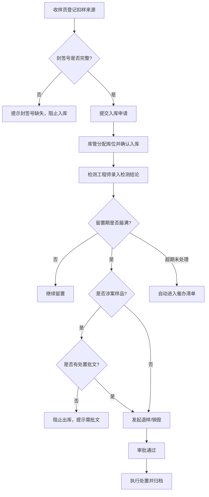
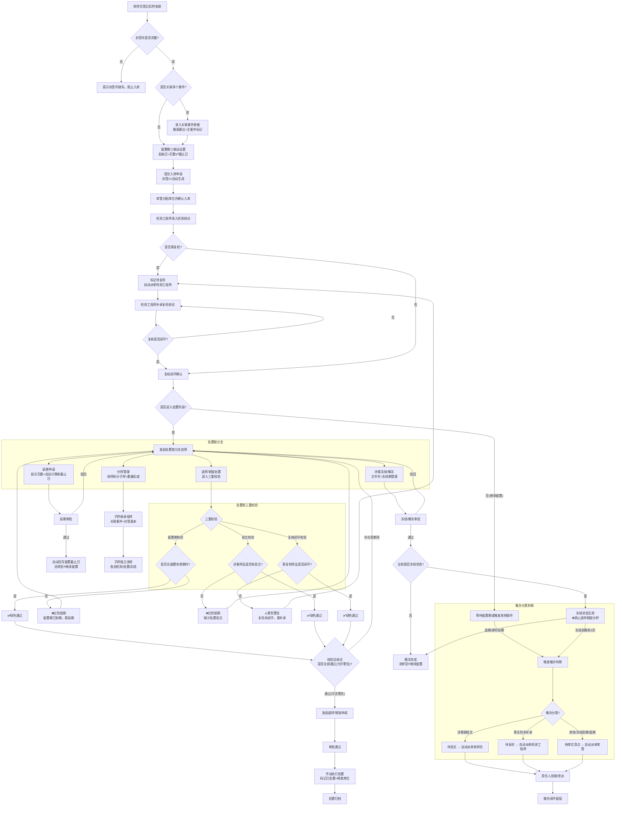

## 1. 产品概述

海关实验室留置样品处置系统，用于管理海关扣留样品从收样登记、检测录入、库位管理到退样/销毁处置的全生命周期流转。解决样品流转记录缺失、封签校验不严、涉案样品违规出库、超期样品无人跟进等痛点，面向海关实验室收样员、检测工程师和库管三类角色。

### v2.0 扩展

#### 扩展目标
本次 v2.0 版本扩展目标：
- 将**延期、分样、涉案冻结**纳入统一处置链，形成完整的处置闭环
- 增强收样登记的**多案件关联**能力，支持一份样品关联多个案件
- 引入**封签版本管理**，封签变更自动升级版本并留痕
- 实现**留置截止日精确管理**，起始日+天数与截止日双向联动计算
- 增加**处置前三重校验**（留置期校验、批文校验、复核闭环校验），前端弹窗与后端双重阻断
- **催办清单按分类自动派单责任人**：待批文→收样员、待复检→检测工程师、待库位清点→库管
- 支持**责任人改派**，手动改派催办责任人并留痕
- 实现**全链路责任人追踪**，所有状态变更留存操作人/角色/时间/原因

#### 业务价值
- **避免处置违规**：三重校验机制确保处置前留置期有效、批文齐全、复核闭环，杜绝违规操作
- **降低审计风险**：全链路操作留痕、封签版本追溯、责任人追踪，满足海关审计合规要求
- **提升催办闭环效率**：分类自动派单，精准匹配责任人，减少催办流转环节，加快超期样品处置速度

## 2. 核心功能

### 2.1 用户角色

| 角色 | 登记方式 | 核心权限 |
|------|----------|----------|
| 收样员 | 系统账号登录 | 登记扣样来源、封签号，提交样品入库 |
| 检测工程师 | 系统账号登录 | 录入检测结论，关联检测报告 |
| 库管 | 系统账号登录 | 分配库位，发起退样/销毁，审批出库 |
| 管理员 | 系统账号登录 | 查看催办清单，系统配置，全流程审计 |

### 2.2 功能模块

1. **收样登记页**: 扣样来源录入、封签号登记与校验、样品基本信息录入、提交入库申请
2. **检测录入页**: 待检测样品列表、检测结论录入、检测报告附件上传、检测完成确认
3. **库位管理页**: 库位分配与调整、在库样品查询、入库确认（封签号必填校验）
4. **处置管理页**: 退样申请与审批、销毁申请与审批、涉案样品批文校验、处置记录归档
5. **催办清单页**: 超期未处理样品自动汇总、催办状态标记、催办通知记录
6. **流转看板页**: 样品全生命周期时间线、当前状态流转图、审批痕迹追溯

### 2.3 页面详情

| 页面名称 | 模块名称 | 功能描述 |
|----------|----------|----------|
| 收样登记 | 来源信息 | 录入扣样来源（执法/检验/抽查）、关联案件编号、样品名称/数量/规格 |
| 收样登记 | 封签登记 | 录入封签号，封签号缺失时阻止入库提交，封签号唯一性校验 |
| 收样登记 | 入库提交 | 校验必填项后提交入库申请，生成样品编号 |
| 检测录入 | 待检列表 | 按状态筛选待检测样品，显示收样基本信息 |
| 检测录入 | 结论录入 | 录入检测结论（合格/不合格/需复检）、检测日期、检测人 |
| 检测录入 | 报告附件 | 上传检测报告PDF/图片 |
| 库位管理 | 库位分配 | 为入库样品分配库位编号，支持批量分配 |
| 库位管理 | 在库查询 | 按库位/状态/日期查询在库样品，支持快速定位 |
| 库位管理 | 入库确认 | 确认样品实际入库，封签号缺失时弹出阻断提示 |
| 处置管理 | 退样申请 | 留置期满后发起退样，填写退样原因和去向 |
| 处置管理 | 销毁申请 | 留置期满后发起销毁，填写销毁方式和见证人 |
| 处置管理 | 涉案校验 | 涉案样品出库时校验处置批文，无批文阻止出库 |
| 处置管理 | 审批流程 | 退样/销毁审批，审批意见记录 |
| 催办清单 | 超期汇总 | 自动汇总超过留置期未处置的样品记录 |
| 催办清单 | 催办操作 | 标记催办状态（已催办/处理中/已完结），记录催办时间 |
| 流转看板 | 时间线 | 展示样品从收样→检测→入库→处置的完整时间线 |
| 流转看板 | 审批痕迹 | 展示每一步审批的操作人、操作时间、审批意见 |
| 流转看板 | 状态流转 | 可视化当前样品所处的流转节点和下一步操作 |
| 收样登记 | 关联案件 | 多案件录入表格、案件搜索建议、主案件单选标记 |
| 收样登记 | 封签版本 | 显示当前版本V1，变更自动升级版本留痕 |
| 收样登记 | 留置期联动 | 起始日+天数⇄截止日双向联动计算 |
| 检测录入 | 复检补录 | 待复检样品Tab、复检结论补录表单、复核闭环状态徽章 |
| 处置管理 | 延期申请 | 延长天数、新截止日自动计算、审批后回写留置期 |
| 处置管理 | 分样管理 | 母样拆分子样、数量校验、子样自动关联母样案件 |
| 处置管理 | 涉案冻结 | 冻结/解冻申请、文书号管理、冻结状态阻断处置 |
| 处置管理 | 三重校验 | 处置前弹窗校验留置期/批文/复核闭环，任一不通过阻断 |
| 处置管理 | 执行操作 | 审批通过后手动执行处置，标记样品已处置并释放库位 |
| 催办清单 | 分类统计 | 顶部4卡片（总数/待批文/待复检/待库位清点），点击切换Tab |
| 催办清单 | 责任人管理 | 责任人列展示、改派Modal、改派原因留痕 |
| 流转看板 | 冻结延期节点 | 冻结步骤图标、延期标签、6个新增子区块展示 |

### v2.0 扩展

#### 2.7 用户角色扩展

| 角色 | 新增权限 | 说明 |
|------|----------|------|
| 管理员 | 流程审计 | 查看全链路操作日志，审计所有状态变更的操作人/角色/时间/原因，识别异常操作 |
| 检测工程师 | 复检结论补录 | 对待复检样品进行复检结论补录，完成复检后标记复核闭环状态 |

#### 2.8 新增功能模块

##### 2.8.1 案件关联管理
- **多案件关联录入**：收样登记时支持添加多条案件记录，每条案件含案件编号、案件名称、关联说明
- **案件搜索**：输入案件编号或名称关键字，实时匹配历史案件并给出搜索建议
- **主案件标记**：关联多个案件时需指定唯一主案件，主案件在流转看板、处置申请中默认展示
- **关联继承**：分样拆分子样时，子样自动继承母样的全部关联案件及主案件标记

##### 2.8.2 封签版本管理
- **版本自动升级**：封签号首次登记为 V1，每次封签变更（破损重封、拆样重封等）自动升级版本号（V2/V3...）
- **变更历史追溯**：记录每次版本变更的操作人、变更时间、变更原因、新旧封签号对照
- **版本徽章展示**：样品详情右上角显示金银铜色版本徽章（V1铜/V2银/V3+金）
- **版本校验**：入库确认、处置出库时校验当前封签版本与系统记录一致，不一致时阻断并提示

##### 2.8.3 分样管理
- **母样拆分子样**：支持从母样中拆分出若干子样，填写子样名称、拆分数量、拆分用途
- **数量扣减校验**：拆分数量不得超过母样当前剩余数量，超出时阻止提交
- **关联继承**：子样自动继承母样的关联案件、封签版本（独立封签时生成新版本）、留置截止日
- **分样关系图**：流转看板中以树状结构展示母样-子样的层级关系
- **子样独立流转**：子样可独立进行检测、处置、冻结等操作，互不影响

##### 2.8.4 延期管理
- **延期申请**：留置期满前可发起延期申请，填写延长天数、延期原因、附件材料
- **自动计算**：根据延长天数自动计算新的留置截止日，实时预览延期前后对比
- **审批流程**：延期申请需库管或管理员审批，审批意见留存
- **自动回写**：审批通过后自动回写样品的留置截止日，更新催办清单的超期判断
- **延期次数记录**：记录每次延期历史，流转看板展示延期标签

##### 2.8.5 涉案冻结管理
- **冻结申请**：对涉案样品发起冻结，填写冻结原因、冻结文书号、冻结期限
- **解冻申请**：冻结期满或案件结束后发起解冻，填写解冻原因、解冻文书号
- **冻结期阻断处置**：冻结状态下禁止发起退样、销毁、分样等处置操作，处置按钮置灰并提示
- **文书号管理**：冻结/解冻均需录入文书号，支持附件上传（扫描件/照片）
- **冻结状态视效**：样品卡片左侧增加蓝色色带，库位格显示冻结雪花图标
- **到期提醒**：冻结到期前 3 天自动进入催办清单，分类为"待库位清点"提醒库管

##### 2.8.6 处置前三重校验
- **留置期校验**：校验当前日期是否在留置有效期内（含延期后），已到期则红色阻断
- **批文校验**：涉案样品校验是否上传处置批文，未上传则红色阻断
- **复核闭环校验**：检测结论为"需复检"的样品校验是否已完成复检补录并闭环，未闭环则黄色警告
- **双重保障**：前端弹窗展示校验结果（绿勾/红叉/黄叹），后端接口再次校验，任一不通过阻断提交
- **校验结果总览**：Modal 顶部总结条显示通过项数/警告项数/阻断项数，底部确认按钮按校验结果启用（阻断项存在时禁用）

##### 2.8.7 催办分类派单
- **待批文**：涉案样品缺少处置批文 → 自动派单给收样员（案件登记人）
- **待复检**：检测结论为"需复检"且未完成补录 → 自动派单给检测工程师（原检测人）
- **待库位清点**：冻结到期、留置即将到期、超期未处置 → 自动派单给库管
- **自动派单规则**：根据催办分类自动匹配责任人，责任人在催办清单的"我的待办"中可见
- **催办推送**：派单后通过系统消息通知责任人，支持邮件/短信推送（可选）

##### 2.8.8 责任人改派
- **手动改派**：管理员或部门负责人可手动改派催办责任人
- **改派Modal**：弹出改派对话框，选择新责任人，填写改派原因（必填）
- **改派留痕**：记录改派前责任人、改派后责任人、改派人、改派时间、改派原因
- **改派通知**：改派后系统消息通知新旧责任人

##### 2.8.9 全链路审计
- **状态变更留痕**：所有样品状态变更（收样、入库、检测、处置、延期、冻结、解冻、改派等）均记录
- **记录字段**：操作人（姓名+工号）、操作角色、操作时间（精确到秒）、操作前状态、操作后状态、操作原因/备注
- **审计查询**：管理员可按样品、操作人、时间范围、操作类型筛选查询审计日志
- **流转看板展示**：在流转看板的时间线节点上展示操作人、角色、时间信息

## 3. 核心流程

样品从收样登记开始，经过封签校验后入库，检测工程师录入检测结论，留置期满后库管发起退样或销毁处置。涉案样品需要批文才能出库，超期未处理的样品自动进入催办清单。整个流程保存完整的流转记录和审批痕迹。

### v2.0 扩展

v2.0 版本在原有流程基础上，新增了多案件关联分支、复检补录闭环、处置前三重校验、延期/分样/冻结三条处置链分支、冻结状态阻断机制，以及催办分类判断与自动派单逻辑。完整流程如下：

## 4. 用户界面设计

### 4.1 设计风格

- **主色调**: 深海蓝(#0F2B46) + 警示琥珀(#D97706) + 通过绿(#059669)
- **辅助色**: 浅灰背景(#F1F5F9)、白色卡片、边框灰(#CBD5E1)
- **按钮风格**: 圆角8px，主要操作深蓝实心，危险操作琥珀实心，次要操作浅灰描边
- **字体**: 标题使用Noto Sans SC Bold，正文使用Noto Sans SC Regular
- **布局**: 左侧固定导航栏 + 顶部状态栏 + 主内容区卡片式布局
- **图标**: 使用Lucide图标库，线性风格

### 4.2 页面设计概览

| 页面名称 | 模块名称 | UI元素 |
|----------|----------|--------|
| 收样登记 | 来源信息 | 表单输入组，标签+输入框对齐布局，必填项红色星标 |
| 收样登记 | 封签登记 | 大号封签号输入框，实时校验状态图标，缺失时红色警告横幅 |
| 检测录入 | 待检列表 | 表格列表，行内操作按钮，状态徽章（待检/已检/复检） |
| 检测录入 | 结论录入 | 下拉选择结论，日期选择器，附件拖拽上传区 |
| 库位管理 | 库位视图 | 网格式库位图，颜色编码状态（空闲/占用/待清理），点击分配 |
| 库位管理 | 在库查询 | 搜索栏+筛选器+数据表格，高亮即将到期样品 |
| 处置管理 | 处置列表 | 卡片式列表，退样/销毁色块区分，涉案标签红色醒目 |
| 处置管理 | 审批流程 | 步骤条+审批意见框，批文上传区（涉案必传） |
| 催办清单 | 超期汇总 | 红色计数徽章，表格按超期天数降序，催办状态切换按钮 |
| 流转看板 | 时间线 | 垂直时间线组件，节点图标+时间戳+操作人，当前节点高亮脉冲动画 |
| 收样登记 | 关联案件表格 | 可添加行的表格、Star图标标记主案件、Search图标搜索建议 |
| 收样登记 | 留置期三联动 | 三个date/number输入框+计算箭头图标，实时联动 |
| 检测录入 | 待复检Tab | 琥珀色标签+警告提示+未闭环红色徽章 |
| 处置管理 | 6Tab布局 | 处置申请/延期申请/分样管理/涉案冻结/审批中心/历史记录 |
| 处置管理 | 校验Modal | 三色图标（绿勾/红叉/黄叹）、顶部总结条、底部确认按钮按校验结果启用 |
| 催办清单 | 分类卡片 | 四色统计卡片（灰/红/橙/蓝）+ Tab切换 |
| 流转看板 | 6个子区块 | 关联案件/封签历史/分样关系/延期记录/冻结记录/复核状态 |

### 4.3 响应式

- 桌面优先设计，最小宽度1280px
- 表格在窄屏下支持横向滚动
- 导航栏在移动端折叠为汉堡菜单

### 4.4 设计特色

- **状态色带**: 每条样品记录左侧有彩色竖条，直观显示当前状态（蓝=收样、绿=检测、灰=在库、琥珀=待处置、红=超期）
- **流转连线**: 看板页面使用动画连线展示样品流转路径
- **封签校验动效**: 封签号校验通过时绿色勾号弹入，缺失时红色叉号抖动

### v2.0 扩展

#### v2.0设计特色

- **校验Modal三色系统**：绿色通过(✅ #059669)、红色阻断(❌ #DC2626)、黄色警告(⚠️ #D97706)，每项校验配独立色块图标，视觉识别度强，顶部总结条显示通过/警告/阻断计数，底部"确认提交"按钮仅在无阻断项时启用
- **催办分类色谱**：全局颜色统一，待批文(红 #DC2626)、待复检(橙 #D97706)、待库位清点(蓝 #2563EB)，分类卡片、Tab高亮、状态徽章均使用对应色谱，用户一眼识别催办类型
- **冻结状态视效**：样品卡片左侧增加蓝色色带(#2563EB，宽度4px)，库位格右上角显示雪花图标(Snowflake)，列表行背景浅蓝色(#EFF6FF)条纹，冻结状态下所有处置按钮统一置灰并添加 Tooltip 提示"冻结中，无法操作"
- **封签版本徽章**：样品详情右上角显示圆形徽章，V1铜色(#B87333)、V2银色(#9CA3AF)、V3+金色(#F59E0B)，徽章悬停显示版本变更历史气泡(操作人/时间/原因)
- **时间线六色节点**：流转看板时间线节点采用六色区分状态，灰默认/绿检测/橙处置/蓝冻结/红催办/紫延期，节点图标对应主题色，节点连接线使用渐变色过渡，支持点击节点展开该步骤详情弹层
