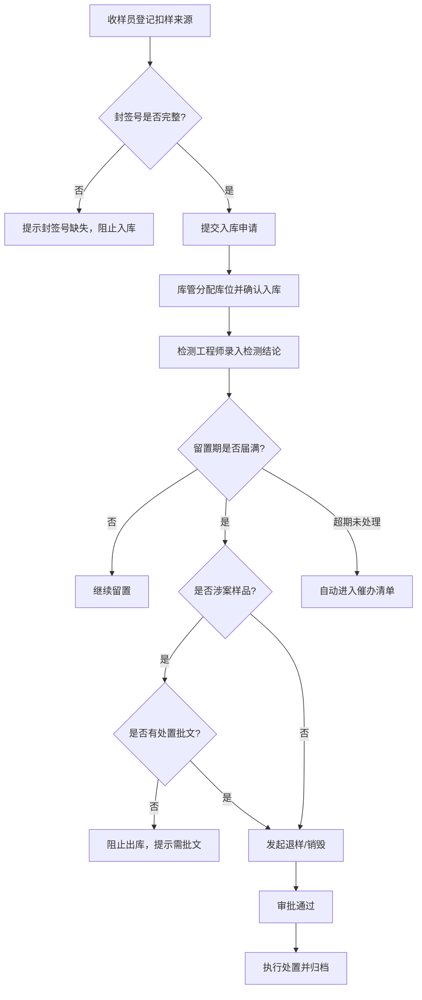

## 1. 产品概述

海关实验室留置样品处置系统，用于管理海关扣留样品从收样登记、检测录入、库位管理到退样/销毁处置的全生命周期流转。解决样品流转记录缺失、封签校验不严、涉案样品违规出库、超期样品无人跟进等痛点，面向海关实验室收样员、检测工程师和库管三类角色。

## 2. 核心功能

### 2.1 用户角色

| 角色 | 登记方式 | 核心权限 |
|------|----------|----------|
| 收样员 | 系统账号登录 | 登记扣样来源、封签号，提交样品入库 |
| 检测工程师 | 系统账号登录 | 录入检测结论，关联检测报告 |
| 库管 | 系统账号登录 | 分配库位，发起退样/销毁，审批出库 |
| 管理员 | 系统账号登录 | 查看催办清单，系统配置，全流程审计 |

### 2.2 功能模块

1. **收样登记页**: 扣样来源录入、封签号登记与校验、样品基本信息录入、提交入库申请
2. **检测录入页**: 待检测样品列表、检测结论录入、检测报告附件上传、检测完成确认
3. **库位管理页**: 库位分配与调整、在库样品查询、入库确认（封签号必填校验）
4. **处置管理页**: 退样申请与审批、销毁申请与审批、涉案样品批文校验、处置记录归档
5. **催办清单页**: 超期未处理样品自动汇总、催办状态标记、催办通知记录
6. **流转看板页**: 样品全生命周期时间线、当前状态流转图、审批痕迹追溯

### 2.3 页面详情

| 页面名称 | 模块名称 | 功能描述 |
|----------|----------|----------|
| 收样登记 | 来源信息 | 录入扣样来源（执法/检验/抽查）、关联案件编号、样品名称/数量/规格 |
| 收样登记 | 封签登记 | 录入封签号，封签号缺失时阻止入库提交，封签号唯一性校验 |
| 收样登记 | 入库提交 | 校验必填项后提交入库申请，生成样品编号 |
| 检测录入 | 待检列表 | 按状态筛选待检测样品，显示收样基本信息 |
| 检测录入 | 结论录入 | 录入检测结论（合格/不合格/需复检）、检测日期、检测人 |
| 检测录入 | 报告附件 | 上传检测报告PDF/图片 |
| 库位管理 | 库位分配 | 为入库样品分配库位编号，支持批量分配 |
| 库位管理 | 在库查询 | 按库位/状态/日期查询在库样品，支持快速定位 |
| 库位管理 | 入库确认 | 确认样品实际入库，封签号缺失时弹出阻断提示 |
| 处置管理 | 退样申请 | 留置期满后发起退样，填写退样原因和去向 |
| 处置管理 | 销毁申请 | 留置期满后发起销毁，填写销毁方式和见证人 |
| 处置管理 | 涉案校验 | 涉案样品出库时校验处置批文，无批文阻止出库 |
| 处置管理 | 审批流程 | 退样/销毁审批，审批意见记录 |
| 催办清单 | 超期汇总 | 自动汇总超过留置期未处置的样品记录 |
| 催办清单 | 催办操作 | 标记催办状态（已催办/处理中/已完结），记录催办时间 |
| 流转看板 | 时间线 | 展示样品从收样→检测→入库→处置的完整时间线 |
| 流转看板 | 审批痕迹 | 展示每一步审批的操作人、操作时间、审批意见 |
| 流转看板 | 状态流转 | 可视化当前样品所处的流转节点和下一步操作 |

## 3. 核心流程

样品从收样登记开始，经过封签校验后入库，检测工程师录入检测结论，留置期满后库管发起退样或销毁处置。涉案样品需要批文才能出库，超期未处理的样品自动进入催办清单。整个流程保存完整的流转记录和审批痕迹。

## 4. 用户界面设计

### 4.1 设计风格

- **主色调**: 深海蓝(#0F2B46) + 警示琥珀(#D97706) + 通过绿(#059669)
- **辅助色**: 浅灰背景(#F1F5F9)、白色卡片、边框灰(#CBD5E1)
- **按钮风格**: 圆角8px，主要操作深蓝实心，危险操作琥珀实心，次要操作浅灰描边
- **字体**: 标题使用Noto Sans SC Bold，正文使用Noto Sans SC Regular
- **布局**: 左侧固定导航栏 + 顶部状态栏 + 主内容区卡片式布局
- **图标**: 使用Lucide图标库，线性风格

### 4.2 页面设计概览

| 页面名称 | 模块名称 | UI元素 |
|----------|----------|--------|
| 收样登记 | 来源信息 | 表单输入组，标签+输入框对齐布局，必填项红色星标 |
| 收样登记 | 封签登记 | 大号封签号输入框，实时校验状态图标，缺失时红色警告横幅 |
| 检测录入 | 待检列表 | 表格列表，行内操作按钮，状态徽章（待检/已检/复检） |
| 检测录入 | 结论录入 | 下拉选择结论，日期选择器，附件拖拽上传区 |
| 库位管理 | 库位视图 | 网格式库位图，颜色编码状态（空闲/占用/待清理），点击分配 |
| 库位管理 | 在库查询 | 搜索栏+筛选器+数据表格，高亮即将到期样品 |
| 处置管理 | 处置列表 | 卡片式列表，退样/销毁色块区分，涉案标签红色醒目 |
| 处置管理 | 审批流程 | 步骤条+审批意见框，批文上传区（涉案必传） |
| 催办清单 | 超期汇总 | 红色计数徽章，表格按超期天数降序，催办状态切换按钮 |
| 流转看板 | 时间线 | 垂直时间线组件，节点图标+时间戳+操作人，当前节点高亮脉冲动画 |

### 4.3 响应式

- 桌面优先设计，最小宽度1280px
- 表格在窄屏下支持横向滚动
- 导航栏在移动端折叠为汉堡菜单

### 4.4 设计特色

- **状态色带**: 每条样品记录左侧有彩色竖条，直观显示当前状态（蓝=收样、绿=检测、灰=在库、琥珀=待处置、红=超期）
- **流转连线**: 看板页面使用动画连线展示样品流转路径
- **封签校验动效**: 封签号校验通过时绿色勾号弹入，缺失时红色叉号抖动
