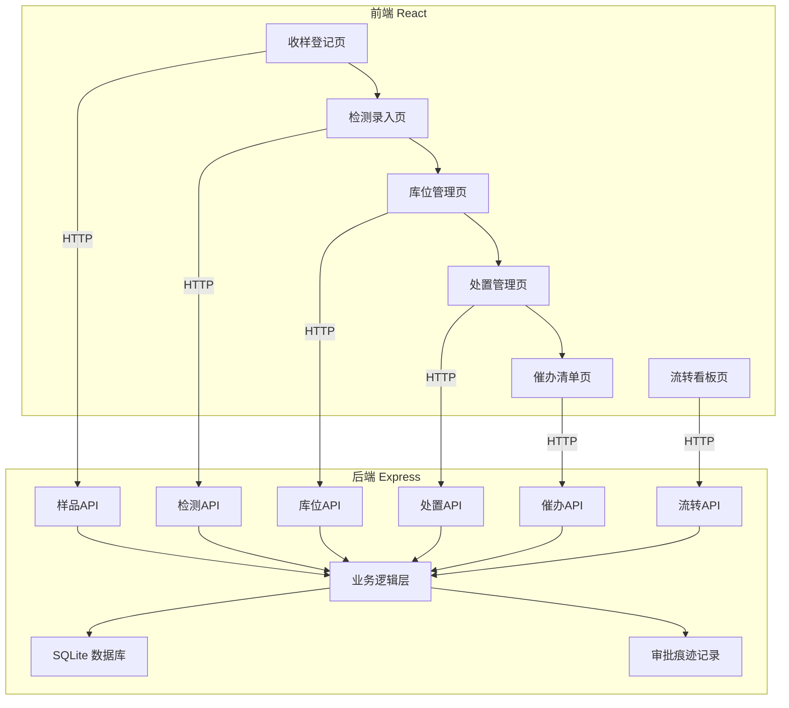
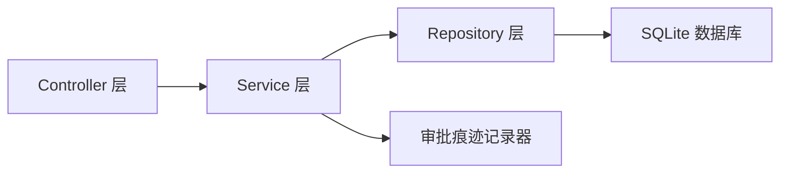
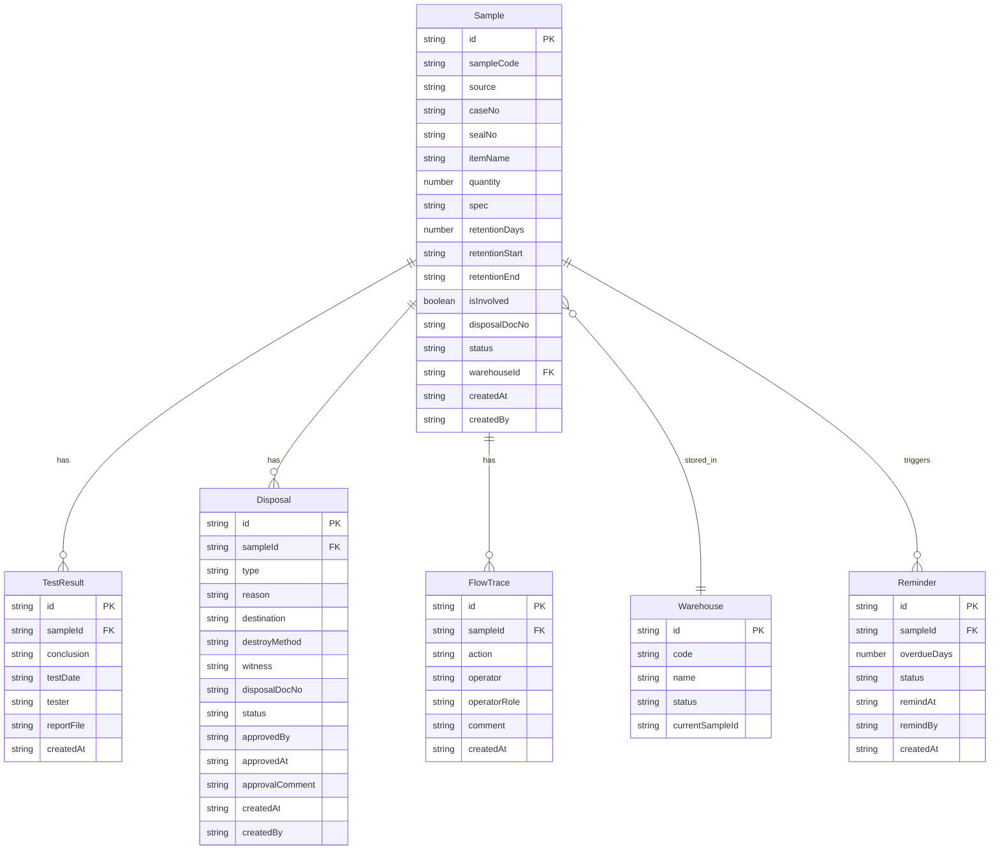

## 1. 架构设计



## 2. 技术说明

- **前端**: React@18 + TypeScript + Tailwind CSS@3 + Vite
- **初始化工具**: vite-init (react-express-ts 模板)
- **后端**: Express@4 + TypeScript (ESM)
- **数据库**: SQLite (better-sqlite3)，随容器启动自动初始化
- **状态管理**: Zustand
- **路由**: react-router-dom
- **图标**: lucide-react
- **日期处理**: date-fns

## 3. 路由定义

| 路由 | 用途 |
|------|------|
| / | 首页仪表盘，样品统计概览 |
| /register | 收样登记页 |
| /testing | 检测录入页 |
| /warehouse | 库位管理页 |
| /disposal | 处置管理页 |
| /reminder | 催办清单页 |
| /trace/:id | 样品流转看板页 |

## 4. API 定义

### 4.1 样品管理

```
GET    /api/samples              查询样品列表（支持状态/日期/关键词筛选）
GET    /api/samples/:id          获取样品详情
POST   /api/samples              新增样品（收样登记）
PUT    /api/samples/:id          更新样品信息
```

### 4.2 检测管理

```
GET    /api/samples/pending-test 获取待检测样品列表
POST   /api/samples/:id/testing  提交检测结论
```

### 4.3 库位管理

```
GET    /api/warehouses           获取库位列表及状态
POST   /api/warehouses/allocate  分配库位
PUT    /api/samples/:id/confirm-in 入库确认
```

### 4.4 处置管理

```
GET    /api/disposals            查询处置申请列表
POST   /api/disposals            发起处置申请（退样/销毁）
PUT    /api/disposals/:id/approve 审批处置申请
```

### 4.5 催办管理

```
GET    /api/reminders            获取催办清单（超期未处理）
PUT    /api/reminders/:id        更新催办状态
```

### 4.6 流转查询

```
GET    /api/samples/:id/trace    获取样品流转全记录
```

### 4.7 数据类型定义

```typescript
interface Sample {
  id: string
  sampleCode: string
  source: '执法扣留' | '检验抽样' | '抽查取样'
  caseNo: string
  sealNo: string
  itemName: string
  quantity: number
  spec: string
  retentionDays: number
  retentionStart: string
  retentionEnd: string
  isInvolved: boolean
  disposalDocNo: string
  status: '待入库' | '在库' | '待检测' | '检测中' | '已检测' | '待处置' | '处置中' | '已处置' | '超期'
  warehouseId: string
  createdAt: string
  createdBy: string
}

interface TestResult {
  id: string
  sampleId: string
  conclusion: '合格' | '不合格' | '需复检'
  testDate: string
  tester: string
  reportFile: string
  createdAt: string
}

interface Disposal {
  id: string
  sampleId: string
  type: '退样' | '销毁'
  reason: string
  destination: string
  destroyMethod: string
  witness: string
  disposalDocNo: string
  status: '待审批' | '已审批' | '已执行'
  approvedBy: string
  approvedAt: string
  approvalComment: string
  createdAt: string
  createdBy: string
}

interface FlowTrace {
  id: string
  sampleId: string
  action: string
  operator: string
  operatorRole: string
  comment: string
  createdAt: string
}

interface Warehouse {
  id: string
  code: string
  name: string
  status: '空闲' | '占用' | '待清理'
  currentSampleId: string
}

interface Reminder {
  id: string
  sampleId: string
  overdueDays: number
  status: '待催办' | '已催办' | '处理中' | '已完结'
  remindAt: string
  remindBy: string
  createdAt: string
}
```

## 5. 服务端架构图



## 6. 数据模型

### 6.1 数据模型定义



### 6.2 数据定义语言

```sql
CREATE TABLE IF NOT EXISTS samples (
  id TEXT PRIMARY KEY,
  sample_code TEXT NOT NULL UNIQUE,
  source TEXT NOT NULL CHECK(source IN ('执法扣留','检验抽样','抽查取样')),
  case_no TEXT NOT NULL,
  seal_no TEXT NOT NULL,
  item_name TEXT NOT NULL,
  quantity INTEGER NOT NULL DEFAULT 1,
  spec TEXT DEFAULT '',
  retention_days INTEGER NOT NULL DEFAULT 90,
  retention_start TEXT NOT NULL,
  retention_end TEXT NOT NULL,
  is_involved INTEGER NOT NULL DEFAULT 0,
  disposal_doc_no TEXT DEFAULT '',
  status TEXT NOT NULL DEFAULT '待入库' CHECK(status IN ('待入库','在库','待检测','检测中','已检测','待处置','处置中','已处置','超期')),
  warehouse_id TEXT DEFAULT '',
  created_at TEXT NOT NULL DEFAULT (datetime('now')),
  created_by TEXT NOT NULL DEFAULT 'system'
);

CREATE TABLE IF NOT EXISTS test_results (
  id TEXT PRIMARY KEY,
  sample_id TEXT NOT NULL,
  conclusion TEXT NOT NULL CHECK(conclusion IN ('合格','不合格','需复检')),
  test_date TEXT NOT NULL,
  tester TEXT NOT NULL,
  report_file TEXT DEFAULT '',
  created_at TEXT NOT NULL DEFAULT (datetime('now')),
  FOREIGN KEY (sample_id) REFERENCES samples(id)
);

CREATE TABLE IF NOT EXISTS disposals (
  id TEXT PRIMARY KEY,
  sample_id TEXT NOT NULL,
  type TEXT NOT NULL CHECK(type IN ('退样','销毁')),
  reason TEXT DEFAULT '',
  destination TEXT DEFAULT '',
  destroy_method TEXT DEFAULT '',
  witness TEXT DEFAULT '',
  disposal_doc_no TEXT DEFAULT '',
  status TEXT NOT NULL DEFAULT '待审批' CHECK(status IN ('待审批','已审批','已执行')),
  approved_by TEXT DEFAULT '',
  approved_at TEXT DEFAULT '',
  approval_comment TEXT DEFAULT '',
  created_at TEXT NOT NULL DEFAULT (datetime('now')),
  created_by TEXT NOT NULL DEFAULT 'system',
  FOREIGN KEY (sample_id) REFERENCES samples(id)
);

CREATE TABLE IF NOT EXISTS flow_traces (
  id TEXT PRIMARY KEY,
  sample_id TEXT NOT NULL,
  action TEXT NOT NULL,
  operator TEXT NOT NULL,
  operator_role TEXT NOT NULL,
  comment TEXT DEFAULT '',
  created_at TEXT NOT NULL DEFAULT (datetime('now')),
  FOREIGN KEY (sample_id) REFERENCES samples(id)
);

CREATE TABLE IF NOT EXISTS warehouses (
  id TEXT PRIMARY KEY,
  code TEXT NOT NULL UNIQUE,
  name TEXT NOT NULL,
  status TEXT NOT NULL DEFAULT '空闲' CHECK(status IN ('空闲','占用','待清理')),
  current_sample_id TEXT DEFAULT ''
);

CREATE TABLE IF NOT EXISTS reminders (
  id TEXT PRIMARY KEY,
  sample_id TEXT NOT NULL,
  overdue_days INTEGER NOT NULL DEFAULT 0,
  status TEXT NOT NULL DEFAULT '待催办' CHECK(status IN ('待催办','已催办','处理中','已完结')),
  remind_at TEXT DEFAULT '',
  remind_by TEXT DEFAULT '',
  created_at TEXT NOT NULL DEFAULT (datetime('now')),
  FOREIGN KEY (sample_id) REFERENCES samples(id)
);

CREATE INDEX IF NOT EXISTS idx_samples_status ON samples(status);
CREATE INDEX IF NOT EXISTS idx_samples_seal_no ON samples(seal_no);
CREATE INDEX IF NOT EXISTS idx_samples_retention_end ON samples(retention_end);
CREATE INDEX IF NOT EXISTS idx_flow_traces_sample_id ON flow_traces(sample_id);
CREATE INDEX IF NOT EXISTS idx_reminders_status ON reminders(status);

INSERT INTO warehouses (id, code, name, status) VALUES
  ('w001', 'A-01-01', 'A区1排1号', '空闲'),
  ('w002', 'A-01-02', 'A区1排2号', '空闲'),
  ('w003', 'A-02-01', 'A区2排1号', '空闲'),
  ('w004', 'A-02-02', 'A区2排2号', '空闲'),
  ('w005', 'B-01-01', 'B区1排1号', '空闲'),
  ('w006', 'B-01-02', 'B区1排2号', '空闲'),
  ('w007', 'B-02-01', 'B区2排1号', '空闲'),
  ('w008', 'B-02-02', 'B区2排2号', '空闲');
```
