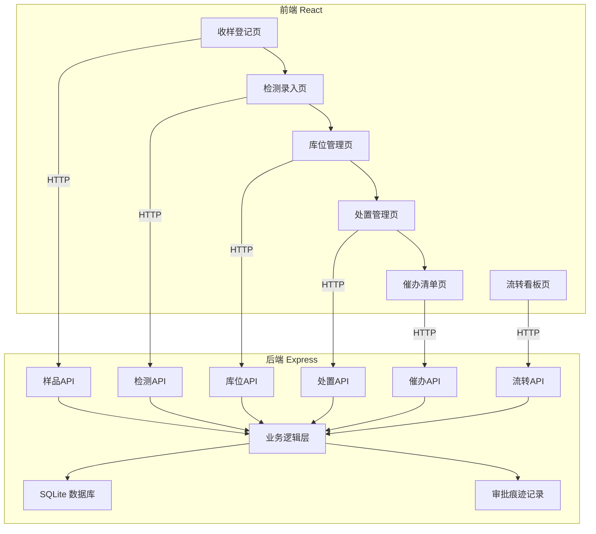
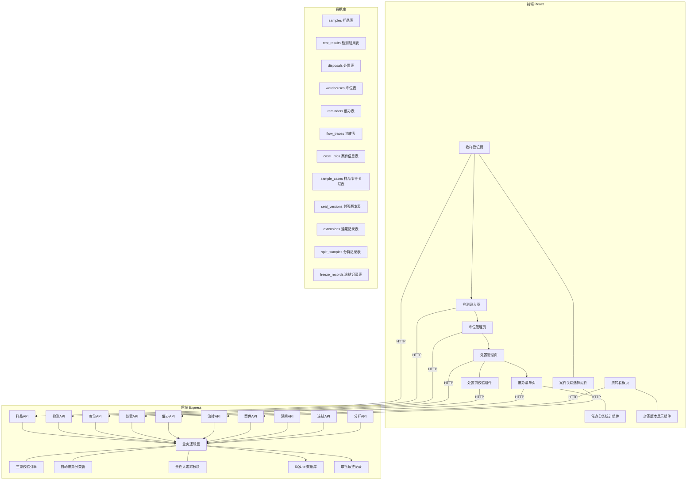
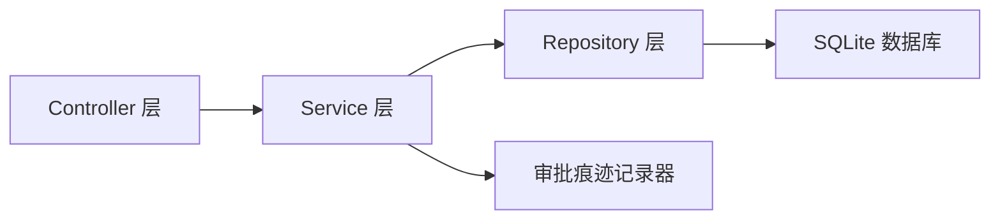
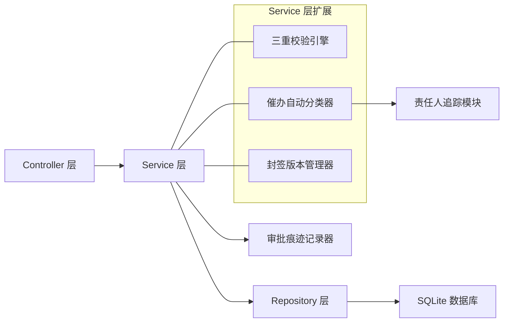
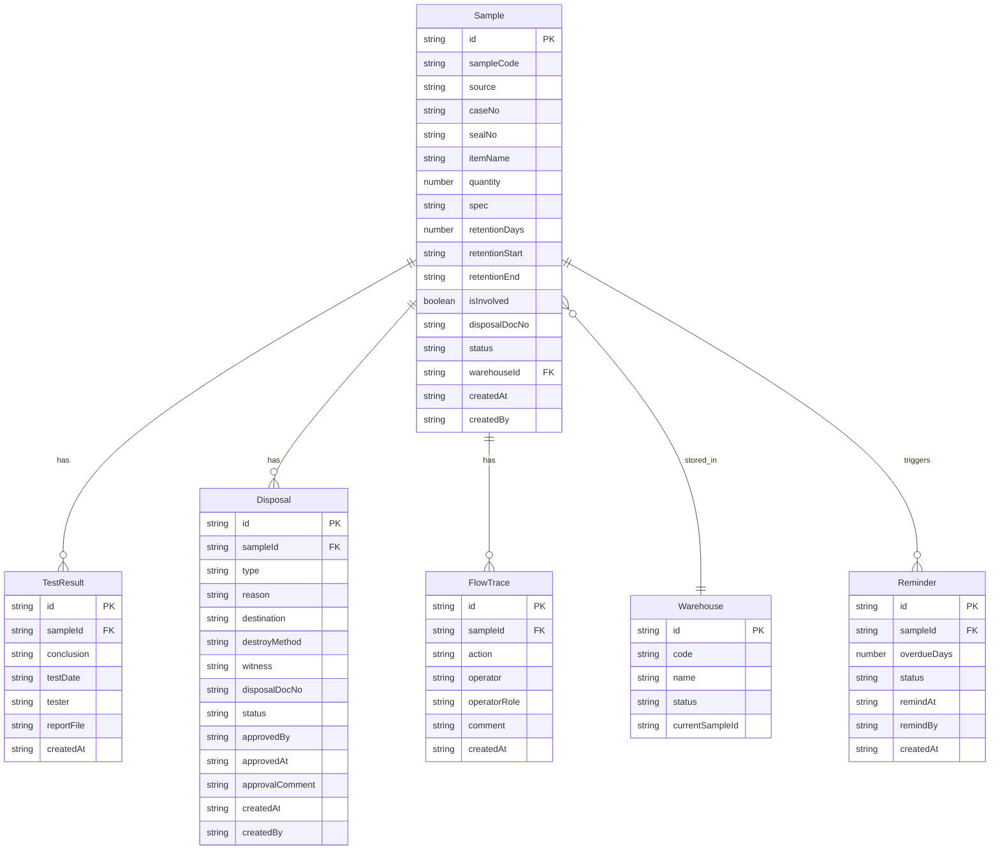
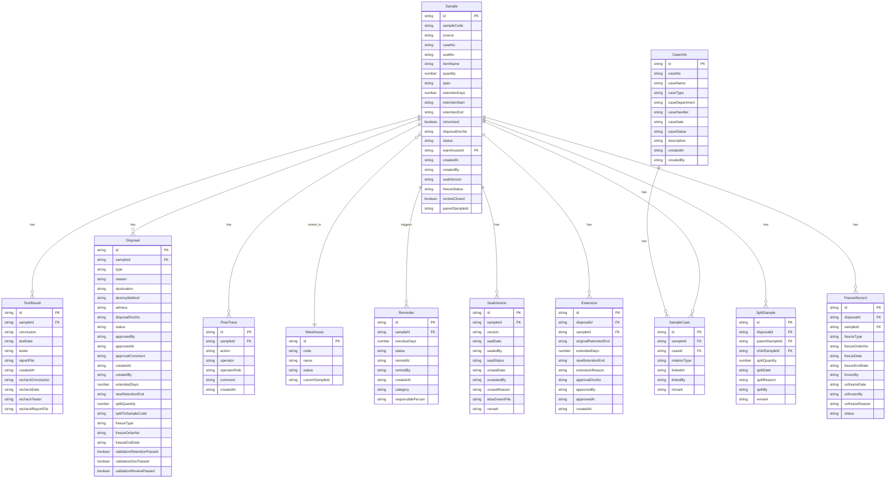

## 1. 架构设计



### v2.0 扩展



## 2. 技术说明

- **前端**: React@18 + TypeScript + Tailwind CSS@3 + Vite
- **初始化工具**: vite-init (react-express-ts 模板)
- **后端**: Express@4 + TypeScript (ESM)
- **数据库**: SQLite (better-sqlite3)，随容器启动自动初始化
- **状态管理**: Zustand
- **路由**: react-router-dom
- **图标**: lucide-react
- **日期处理**: date-fns

### v2.0 扩展

- **数据库**: 使用 sql.js 支持浏览器内存操作 + 文件持久化（导出/导入 .db 文件）
- **新增业务库**:
  - `uuid`：ID 生成器，用于所有主键和关联 ID
  - `date-fns`：留置期计算、三重校验中的日期差值、催办逾期天数计算
- **状态机扩展**:
  - `SampleStatus` 新增 **已冻结**（共 10 种）：`待入库`、`在库`、`待检测`、`检测中`、`已检测`、`待处置`、`处置中`、`已处置`、`超期`、`已冻结`
  - `DisposalType` 新增 **延期/分样/冻结/解冻**（共 6 种）：`退样`、`销毁`、`延期`、`分样`、`冻结`、`解冻`
  - `DisposalStatus` 新增 **已驳回**（共 4 种）：`待审批`、`已审批`、`已执行`、`已驳回`
  - `催办分类 category`（4 种）：`留置到期`、`检测超期`、`待处置超时`、`审批待处理`

## 3. 路由定义

| 路由 | 用途 |
|------|------|
| / | 首页仪表盘，样品统计概览 |
| /register | 收样登记页 |
| /testing | 检测录入页 |
| /warehouse | 库位管理页 |
| /disposal | 处置管理页 |
| /reminder | 催办清单页 |
| /trace/:id | 样品流转看板页 |

### v2.0 扩展

无需新增路由，原有页面内部通过 Tab 组件实现功能扩展：
- **收样登记页**：基础信息 Tab + 案件关联 Tab + 封签版本 Tab
- **检测录入页**：初次检测 Tab + 复检补录 Tab + 检测记录 Tab
- **处置管理页**：退样/销毁 Tab + 延期 Tab + 冻结/解冻 Tab + 分样 Tab + 三重校验 Tab
- **催办清单页**：待办清单 Tab + 分类统计 Tab + 责任人改派 Tab
- **流转看板页**：流转轨迹 Tab + 封签版本 Tab + 关联案件 Tab

## 4. API 定义

### 4.1 样品管理

```
GET    /api/samples              查询样品列表（支持状态/日期/关键词筛选）
GET    /api/samples/:id          获取样品详情
POST   /api/samples              新增样品（收样登记）
PUT    /api/samples/:id          更新样品信息
POST   /api/samples/:id/add-case 追加关联案件
POST   /api/samples/:id/split    分样操作
GET    /api/cases                案件搜索(支持keyword参数)
```

### 4.2 检测管理

```
GET    /api/samples/pending-test   获取待检测样品列表
POST   /api/samples/:id/testing    提交检测结论
GET    /api/samples/pending-recheck 获取待补录复检样品列表
PUT    /api/samples/:id/recheck    补录复检结论
GET    /api/samples/:id/test-results 获取样品所有检测记录
```

### 4.3 库位管理

```
GET    /api/warehouses           获取库位列表及状态
POST   /api/warehouses/allocate  分配库位
PUT    /api/samples/:id/confirm-in 入库确认
```

### 4.4 处置管理

```
GET    /api/disposals            查询处置申请列表
POST   /api/disposals            发起处置申请（退样/销毁/延期/分样/冻结/解冻）
PUT    /api/disposals/:id/approve 审批处置申请
POST   /api/disposals/validate   处置前三重校验
PUT    /api/disposals/:id/execute 执行处置(审批通过后)
GET    /api/extensions           查询延期记录列表
GET    /api/freeze-records       查询冻结记录列表
GET    /api/split-samples        查询分样记录列表
```

### 4.5 催办管理

```
GET    /api/reminders            获取催办清单（超期未处理）
PUT    /api/reminders/:id        更新催办状态
GET    /api/reminders/stats      分类统计数据
POST   /api/reminders/:id/reassign 改派催办责任人
```

### 4.6 流转查询

```
GET    /api/samples/:id/trace    获取样品流转全记录
```

### 4.7 数据类型定义

```typescript
interface Sample {
  id: string
  sampleCode: string
  source: '执法扣留' | '检验抽样' | '抽查取样'
  caseNo: string
  sealNo: string
  itemName: string
  quantity: number
  spec: string
  retentionDays: number
  retentionStart: string
  retentionEnd: string
  isInvolved: boolean
  disposalDocNo: string
  status: '待入库' | '在库' | '待检测' | '检测中' | '已检测' | '待处置' | '处置中' | '已处置' | '超期'
  warehouseId: string
  createdAt: string
  createdBy: string
}

interface TestResult {
  id: string
  sampleId: string
  conclusion: '合格' | '不合格' | '需复检'
  testDate: string
  tester: string
  reportFile: string
  createdAt: string
}

interface Disposal {
  id: string
  sampleId: string
  type: '退样' | '销毁'
  reason: string
  destination: string
  destroyMethod: string
  witness: string
  disposalDocNo: string
  status: '待审批' | '已审批' | '已执行'
  approvedBy: string
  approvedAt: string
  approvalComment: string
  createdAt: string
  createdBy: string
}

interface FlowTrace {
  id: string
  sampleId: string
  action: string
  operator: string
  operatorRole: string
  comment: string
  createdAt: string
}

interface Warehouse {
  id: string
  code: string
  name: string
  status: '空闲' | '占用' | '待清理'
  currentSampleId: string
}

interface Reminder {
  id: string
  sampleId: string
  overdueDays: number
  status: '待催办' | '已催办' | '处理中' | '已完结'
  remindAt: string
  remindBy: string
  createdAt: string
}
```

### v2.0 扩展

```typescript
interface Sample {
  id: string
  sampleCode: string
  source: '执法扣留' | '检验抽样' | '抽查取样'
  caseNo: string
  sealNo: string
  itemName: string
  quantity: number
  spec: string
  retentionDays: number
  retentionStart: string
  retentionEnd: string
  isInvolved: boolean
  disposalDocNo: string
  status: '待入库' | '在库' | '待检测' | '检测中' | '已检测' | '待处置' | '处置中' | '已处置' | '超期' | '已冻结'
  warehouseId: string
  createdAt: string
  createdBy: string
  sealVersion: string
  freezeStatus: '未冻结' | '已冻结' | '已解冻'
  reviewClosed: boolean
  parentSampleId: string
}

interface TestResult {
  id: string
  sampleId: string
  conclusion: '合格' | '不合格' | '需复检'
  testDate: string
  tester: string
  reportFile: string
  createdAt: string
  recheckConclusion: '合格' | '不合格' | '待补录'
  recheckDate: string
  recheckTester: string
  recheckReportFile: string
}

interface Disposal {
  id: string
  sampleId: string
  type: '退样' | '销毁' | '延期' | '分样' | '冻结' | '解冻'
  reason: string
  destination: string
  destroyMethod: string
  witness: string
  disposalDocNo: string
  status: '待审批' | '已审批' | '已执行' | '已驳回'
  approvedBy: string
  approvedAt: string
  approvalComment: string
  createdAt: string
  createdBy: string
  extendedDays: number
  newRetentionEnd: string
  splitQuantity: number
  splitToSampleCode: string
  freezeType: '涉案冻结' | '证据保全' | '其他'
  freezeOrderNo: string
  freezeEndDate: string
  validationRetentionPassed: boolean
  validationDocPassed: boolean
  validationReviewPassed: boolean
}

interface Reminder {
  id: string
  sampleId: string
  overdueDays: number
  status: '待催办' | '已催办' | '处理中' | '已完结'
  remindAt: string
  remindBy: string
  createdAt: string
  category: '留置到期' | '检测超期' | '待处置超时' | '审批待处理'
  responsiblePerson: string
}

interface CaseInfo {
  id: string
  caseNo: string
  caseName: string
  caseType: '行政案件' | '刑事案件' | '民事案件' | '其他'
  caseDepartment: string
  caseHandler: string
  caseDate: string
  caseStatus: '在办' | '已结案' | '已移送' | '已撤销'
  description: string
  createdAt: string
  createdBy: string
}

interface SampleCase {
  id: string
  sampleId: string
  caseId: string
  relationType: '主要涉案' | '关联涉案' | '证据'
  linkedAt: string
  linkedBy: string
  remark: string
}

interface SealVersion {
  id: string
  sampleId: string
  version: string
  sealDate: string
  sealedBy: string
  sealStatus: '有效' | '已启封' | '已重封'
  unsealDate: string
  unsealedBy: string
  unsealReason: string
  attachmentFile: string
  remark: string
}

interface Extension {
  id: string
  disposalId: string
  sampleId: string
  originalRetentionEnd: string
  extendedDays: number
  newRetentionEnd: string
  extensionReason: string
  approvalDocNo: string
  approvedBy: string
  approvedAt: string
  createdAt: string
}

interface SplitSample {
  id: string
  disposalId: string
  parentSampleId: string
  childSampleId: string
  splitQuantity: number
  splitDate: string
  splitReason: string
  splitBy: string
  remark: string
}

interface FreezeRecord {
  id: string
  disposalId: string
  sampleId: string
  freezeType: '涉案冻结' | '证据保全' | '其他'
  freezeOrderNo: string
  freezeDate: string
  freezeEndDate: string
  frozenBy: string
  unfreezeDate: string
  unfrozenBy: string
  unfreezeReason: string
  status: '已冻结' | '已解冻' | '已逾期'
}
```

### 4.8 案件管理

案件信息作为样品的关联业务数据，支持多案件关联。

```
GET    /api/cases                       查询案件列表（支持keyword模糊搜索）
GET    /api/cases/:id                   获取案件详情
POST   /api/cases                       新增案件
PUT    /api/cases/:id                   更新案件信息
DELETE /api/cases/:id                   删除案件
GET    /api/samples/:id/cases           获取样品关联的案件列表
DELETE /api/samples/:sampleId/cases/:caseId 解除样品与案件关联
```

### 4.9 延期管理

延期与 `disposals` 关联，当 `type=延期` 时，系统同步写入 `extensions` 表，并更新对应样品的 `retentionEnd` 字段。

```
GET    /api/extensions                  查询延期记录列表（支持按样品/日期筛选）
GET    /api/extensions/:id              获取延期详情
GET    /api/samples/:id/extensions      获取样品所有延期历史
POST   /api/disposals                   (type=延期) 创建延期申请，审批通过后自动写入extensions
PUT    /api/disposals/:id/approve       审批通过：写入extensions + 更新samples.retention_end
PUT    /api/disposals/:id/execute       执行延期：状态流转 + 生成流转痕迹
```

### 4.10 冻结管理

冻结/解冻与 `disposals` 关联，当 `type=冻结` 或 `type=解冻` 时，系统同步写入 `freeze_records` 表，并更新对应样品的 `freezeStatus` 字段。冻结状态会阻断退样/销毁操作。

```
GET    /api/freeze-records              查询冻结记录列表（支持按状态/日期筛选）
GET    /api/freeze-records/:id          获取冻结详情
GET    /api/samples/:id/freeze-records  获取样品所有冻结/解冻历史
POST   /api/disposals                   (type=冻结) 创建冻结申请，审批通过后写入freeze_records
POST   /api/disposals                   (type=解冻) 创建解冻申请，审批通过后更新freeze_records.status
PUT    /api/disposals/:id/approve       审批通过：写入/更新freeze_records + 更新samples.freeze_status
PUT    /api/disposals/:id/execute       执行冻结/解冻：状态流转 + 生成流转痕迹
```

### 4.11 分样管理

分样与 `disposals` 关联，当 `type=分样` 时，系统同步：
1. 写入 `split_samples` 关联表
2. 创建新 `sample` 记录（子样品，`parentSampleId` 指向原样品）
3. 更新原样品 `quantity` 扣减分样数量

```
GET    /api/split-samples               查询分样记录列表（支持按样品筛选）
GET    /api/split-samples/:id           获取分样详情
GET    /api/samples/:id/split-history   获取样品的分样历史（分入+分出）
POST   /api/disposals                   (type=分样) 创建分样申请，需指定splitQuantity
PUT    /api/disposals/:id/approve       审批通过：创建子样品 + 写入split_samples + 更新原样品数量
PUT    /api/disposals/:id/execute       执行分样：状态流转 + 生成流转痕迹
```

### 4.12 三重校验引擎

处置申请提交前强制执行三重校验（`POST /api/disposals/validate`），校验算法如下：

```
function tripleValidation(sampleId, disposalType): ValidationResult {
  const sample = getSample(sampleId)
  const today = new Date()

  // 校验1：留置期校验
  const daysRemaining = diffDays(sample.retentionEnd, today)
  let retentionPassed = false
  if (disposalType in ['延期', '冻结', '解冻']) {
    retentionPassed = true  // 延期/冻结/解冻跳过留置期校验
  } else if (disposalType in ['退样', '销毁']) {
    retentionPassed = daysRemaining <= 0
  }

  // 校验2：批文校验（涉案样品必须有批文号）
  const docPassed = !sample.isInvolved || (sample.disposalDocNo && sample.disposalDocNo.trim() !== '')

  // 校验3：复核闭环校验（最新检测=需复检时必须已补录结论）
  const latestTest = getLatestTestResult(sampleId)
  let reviewPassed = true
  if (latestTest && latestTest.conclusion === '需复检') {
    reviewPassed = latestTest.recheckConclusion
      && latestTest.recheckConclusion !== '待补录'
      && latestTest.recheckConclusion !== ''
  }

  // 附加：冻结状态阻断
  const freezeBlocked = sample.freezeStatus === '已冻结'
    && disposalType in ['退样', '销毁', '分样']

  return {
    validationRetentionPassed: retentionPassed,
    validationDocPassed: docPassed,
    validationReviewPassed: reviewPassed,
    freezeBlocked: freezeBlocked,
    passed: retentionPassed && docPassed && reviewPassed && !freezeBlocked,
    errors: [
      !retentionPassed && `留置期剩余 ${daysRemaining} 天，需到期后方可${disposalType}`,
      !docPassed && '涉案样品需录入处置批文号',
      !reviewPassed && '检测结论为需复检，请先补录复检结论',
      freezeBlocked && '样品当前为冻结状态，阻断退样/销毁/分样操作'
    ].filter(Boolean)
  }
}
```

## 5. 服务端架构图



### v2.0 扩展



## 6. 数据模型

### 6.1 数据模型定义



#### v2.0 扩展 ER 图



### 6.2 数据定义语言

```sql
CREATE TABLE IF NOT EXISTS samples (
  id TEXT PRIMARY KEY,
  sample_code TEXT NOT NULL UNIQUE,
  source TEXT NOT NULL CHECK(source IN ('执法扣留','检验抽样','抽查取样')),
  case_no TEXT NOT NULL,
  seal_no TEXT NOT NULL,
  item_name TEXT NOT NULL,
  quantity INTEGER NOT NULL DEFAULT 1,
  spec TEXT DEFAULT '',
  retention_days INTEGER NOT NULL DEFAULT 90,
  retention_start TEXT NOT NULL,
  retention_end TEXT NOT NULL,
  is_involved INTEGER NOT NULL DEFAULT 0,
  disposal_doc_no TEXT DEFAULT '',
  status TEXT NOT NULL DEFAULT '待入库' CHECK(status IN ('待入库','在库','待检测','检测中','已检测','待处置','处置中','已处置','超期')),
  warehouse_id TEXT DEFAULT '',
  created_at TEXT NOT NULL DEFAULT (datetime('now')),
  created_by TEXT NOT NULL DEFAULT 'system'
);

CREATE TABLE IF NOT EXISTS test_results (
  id TEXT PRIMARY KEY,
  sample_id TEXT NOT NULL,
  conclusion TEXT NOT NULL CHECK(conclusion IN ('合格','不合格','需复检')),
  test_date TEXT NOT NULL,
  tester TEXT NOT NULL,
  report_file TEXT DEFAULT '',
  created_at TEXT NOT NULL DEFAULT (datetime('now')),
  FOREIGN KEY (sample_id) REFERENCES samples(id)
);

CREATE TABLE IF NOT EXISTS disposals (
  id TEXT PRIMARY KEY,
  sample_id TEXT NOT NULL,
  type TEXT NOT NULL CHECK(type IN ('退样','销毁')),
  reason TEXT DEFAULT '',
  destination TEXT DEFAULT '',
  destroy_method TEXT DEFAULT '',
  witness TEXT DEFAULT '',
  disposal_doc_no TEXT DEFAULT '',
  status TEXT NOT NULL DEFAULT '待审批' CHECK(status IN ('待审批','已审批','已执行')),
  approved_by TEXT DEFAULT '',
  approved_at TEXT DEFAULT '',
  approval_comment TEXT DEFAULT '',
  created_at TEXT NOT NULL DEFAULT (datetime('now')),
  created_by TEXT NOT NULL DEFAULT 'system',
  FOREIGN KEY (sample_id) REFERENCES samples(id)
);

CREATE TABLE IF NOT EXISTS flow_traces (
  id TEXT PRIMARY KEY,
  sample_id TEXT NOT NULL,
  action TEXT NOT NULL,
  operator TEXT NOT NULL,
  operator_role TEXT NOT NULL,
  comment TEXT DEFAULT '',
  created_at TEXT NOT NULL DEFAULT (datetime('now')),
  FOREIGN KEY (sample_id) REFERENCES samples(id)
);

CREATE TABLE IF NOT EXISTS warehouses (
  id TEXT PRIMARY KEY,
  code TEXT NOT NULL UNIQUE,
  name TEXT NOT NULL,
  status TEXT NOT NULL DEFAULT '空闲' CHECK(status IN ('空闲','占用','待清理')),
  current_sample_id TEXT DEFAULT ''
);

CREATE TABLE IF NOT EXISTS reminders (
  id TEXT PRIMARY KEY,
  sample_id TEXT NOT NULL,
  overdue_days INTEGER NOT NULL DEFAULT 0,
  status TEXT NOT NULL DEFAULT '待催办' CHECK(status IN ('待催办','已催办','处理中','已完结')),
  remind_at TEXT DEFAULT '',
  remind_by TEXT DEFAULT '',
  created_at TEXT NOT NULL DEFAULT (datetime('now')),
  FOREIGN KEY (sample_id) REFERENCES samples(id)
);

CREATE INDEX IF NOT EXISTS idx_samples_status ON samples(status);
CREATE INDEX IF NOT EXISTS idx_samples_seal_no ON samples(seal_no);
CREATE INDEX IF NOT EXISTS idx_samples_retention_end ON samples(retention_end);
CREATE INDEX IF NOT EXISTS idx_flow_traces_sample_id ON flow_traces(sample_id);
CREATE INDEX IF NOT EXISTS idx_reminders_status ON reminders(status);

INSERT INTO warehouses (id, code, name, status) VALUES
  ('w001', 'A-01-01', 'A区1排1号', '空闲'),
  ('w002', 'A-01-02', 'A区1排2号', '空闲'),
  ('w003', 'A-02-01', 'A区2排1号', '空闲'),
  ('w004', 'A-02-02', 'A区2排2号', '空闲'),
  ('w005', 'B-01-01', 'B区1排1号', '空闲'),
  ('w006', 'B-01-02', 'B区1排2号', '空闲'),
  ('w007', 'B-02-01', 'B区2排1号', '空闲'),
  ('w008', 'B-02-02', 'B区2排2号', '空闲');

-- ===== v2.0 扩展：新增表 =====

CREATE TABLE IF NOT EXISTS case_infos (
  id TEXT PRIMARY KEY,
  case_no TEXT NOT NULL UNIQUE,
  case_name TEXT NOT NULL,
  case_type TEXT NOT NULL DEFAULT '其他' CHECK(case_type IN ('行政案件','刑事案件','民事案件','其他')),
  case_department TEXT DEFAULT '',
  case_handler TEXT DEFAULT '',
  case_date TEXT DEFAULT '',
  case_status TEXT NOT NULL DEFAULT '在办' CHECK(case_status IN ('在办','已结案','已移送','已撤销')),
  description TEXT DEFAULT '',
  created_at TEXT NOT NULL DEFAULT (datetime('now')),
  created_by TEXT NOT NULL DEFAULT 'system'
);

CREATE TABLE IF NOT EXISTS sample_cases (
  id TEXT PRIMARY KEY,
  sample_id TEXT NOT NULL,
  case_id TEXT NOT NULL,
  relation_type TEXT NOT NULL DEFAULT '关联涉案' CHECK(relation_type IN ('主要涉案','关联涉案','证据')),
  linked_at TEXT NOT NULL DEFAULT (datetime('now')),
  linked_by TEXT NOT NULL DEFAULT 'system',
  remark TEXT DEFAULT '',
  FOREIGN KEY (sample_id) REFERENCES samples(id),
  FOREIGN KEY (case_id) REFERENCES case_infos(id),
  UNIQUE(sample_id, case_id)
);

CREATE TABLE IF NOT EXISTS seal_versions (
  id TEXT PRIMARY KEY,
  sample_id TEXT NOT NULL,
  version TEXT NOT NULL,
  seal_date TEXT NOT NULL,
  sealed_by TEXT NOT NULL,
  seal_status TEXT NOT NULL DEFAULT '有效' CHECK(seal_status IN ('有效','已启封','已重封')),
  unseal_date TEXT DEFAULT '',
  unsealed_by TEXT DEFAULT '',
  unseal_reason TEXT DEFAULT '',
  attachment_file TEXT DEFAULT '',
  remark TEXT DEFAULT '',
  created_at TEXT NOT NULL DEFAULT (datetime('now')),
  FOREIGN KEY (sample_id) REFERENCES samples(id)
);

CREATE TABLE IF NOT EXISTS extensions (
  id TEXT PRIMARY KEY,
  disposal_id TEXT NOT NULL,
  sample_id TEXT NOT NULL,
  original_retention_end TEXT NOT NULL,
  extended_days INTEGER NOT NULL DEFAULT 30,
  new_retention_end TEXT NOT NULL,
  extension_reason TEXT DEFAULT '',
  approval_doc_no TEXT DEFAULT '',
  approved_by TEXT DEFAULT '',
  approved_at TEXT DEFAULT '',
  created_at TEXT NOT NULL DEFAULT (datetime('now')),
  FOREIGN KEY (disposal_id) REFERENCES disposals(id),
  FOREIGN KEY (sample_id) REFERENCES samples(id)
);

CREATE TABLE IF NOT EXISTS split_samples (
  id TEXT PRIMARY KEY,
  disposal_id TEXT NOT NULL,
  parent_sample_id TEXT NOT NULL,
  child_sample_id TEXT NOT NULL,
  split_quantity INTEGER NOT NULL DEFAULT 1,
  split_date TEXT NOT NULL,
  split_reason TEXT DEFAULT '',
  split_by TEXT NOT NULL,
  remark TEXT DEFAULT '',
  created_at TEXT NOT NULL DEFAULT (datetime('now')),
  FOREIGN KEY (disposal_id) REFERENCES disposals(id),
  FOREIGN KEY (parent_sample_id) REFERENCES samples(id),
  FOREIGN KEY (child_sample_id) REFERENCES samples(id)
);

CREATE TABLE IF NOT EXISTS freeze_records (
  id TEXT PRIMARY KEY,
  disposal_id TEXT NOT NULL,
  sample_id TEXT NOT NULL,
  freeze_type TEXT NOT NULL DEFAULT '其他' CHECK(freeze_type IN ('涉案冻结','证据保全','其他')),
  freeze_order_no TEXT DEFAULT '',
  freeze_date TEXT NOT NULL,
  freeze_end_date TEXT DEFAULT '',
  frozen_by TEXT NOT NULL,
  unfreeze_date TEXT DEFAULT '',
  unfrozen_by TEXT DEFAULT '',
  unfreeze_reason TEXT DEFAULT '',
  status TEXT NOT NULL DEFAULT '已冻结' CHECK(status IN ('已冻结','已解冻','已逾期')),
  created_at TEXT NOT NULL DEFAULT (datetime('now')),
  FOREIGN KEY (disposal_id) REFERENCES disposals(id),
  FOREIGN KEY (sample_id) REFERENCES samples(id)
);

-- ===== v2.0 扩展：新增索引 =====

CREATE INDEX IF NOT EXISTS idx_case_infos_case_no ON case_infos(case_no);
CREATE INDEX IF NOT EXISTS idx_case_infos_case_status ON case_infos(case_status);
CREATE INDEX IF NOT EXISTS idx_sample_cases_sample_id ON sample_cases(sample_id);
CREATE INDEX IF NOT EXISTS idx_sample_cases_case_id ON sample_cases(case_id);
CREATE INDEX IF NOT EXISTS idx_seal_versions_sample_id ON seal_versions(sample_id);
CREATE INDEX IF NOT EXISTS idx_extensions_sample_id ON extensions(sample_id);
CREATE INDEX IF NOT EXISTS idx_freeze_records_sample_id ON freeze_records(sample_id);
CREATE INDEX IF NOT EXISTS idx_split_samples_parent_sample_id ON split_samples(parent_sample_id);

-- ===== v2.0 扩展：旧表ALTER TABLE补充列 =====

ALTER TABLE samples ADD COLUMN IF NOT EXISTS seal_version TEXT DEFAULT '';
ALTER TABLE samples ADD COLUMN IF NOT EXISTS freeze_status TEXT DEFAULT '未冻结' CHECK(freeze_status IN ('未冻结','已冻结','已解冻'));
ALTER TABLE samples ADD COLUMN IF NOT EXISTS review_closed INTEGER NOT NULL DEFAULT 1;
ALTER TABLE samples ADD COLUMN IF NOT EXISTS parent_sample_id TEXT DEFAULT '';

ALTER TABLE test_results ADD COLUMN IF NOT EXISTS recheck_conclusion TEXT DEFAULT '' CHECK(recheck_conclusion IN ('','合格','不合格','待补录'));
ALTER TABLE test_results ADD COLUMN IF NOT EXISTS recheck_date TEXT DEFAULT '';
ALTER TABLE test_results ADD COLUMN IF NOT EXISTS recheck_tester TEXT DEFAULT '';
ALTER TABLE test_results ADD COLUMN IF NOT EXISTS recheck_report_file TEXT DEFAULT '';

ALTER TABLE disposals ADD COLUMN IF NOT EXISTS extended_days INTEGER DEFAULT 0;
ALTER TABLE disposals ADD COLUMN IF NOT EXISTS new_retention_end TEXT DEFAULT '';
ALTER TABLE disposals ADD COLUMN IF NOT EXISTS split_quantity INTEGER DEFAULT 0;
ALTER TABLE disposals ADD COLUMN IF NOT EXISTS split_to_sample_code TEXT DEFAULT '';
ALTER TABLE disposals ADD COLUMN IF NOT EXISTS freeze_type TEXT DEFAULT '';
ALTER TABLE disposals ADD COLUMN IF NOT EXISTS freeze_order_no TEXT DEFAULT '';
ALTER TABLE disposals ADD COLUMN IF NOT EXISTS freeze_end_date TEXT DEFAULT '';
ALTER TABLE disposals ADD COLUMN IF NOT EXISTS validation_retention_passed INTEGER DEFAULT 0;
ALTER TABLE disposals ADD COLUMN IF NOT EXISTS validation_doc_passed INTEGER DEFAULT 0;
ALTER TABLE disposals ADD COLUMN IF NOT EXISTS validation_review_passed INTEGER DEFAULT 0;

ALTER TABLE reminders ADD COLUMN IF NOT EXISTS category TEXT DEFAULT '' CHECK(category IN ('','留置到期','检测超期','待处置超时','审批待处理'));
ALTER TABLE reminders ADD COLUMN IF NOT EXISTS responsible_person TEXT DEFAULT '';
```
